# Smart Household Finance Agent

> An AI-powered household expense tracker that scans receipts using Google Gemini Vision API and stores data in Supabase.

---

## Features

| Feature | Description |
|---|---|
| **Receipt Scanning** | Upload a photo — Gemini AI extracts store, date, items, brands, and total automatically |
| **Itemized Categorization** | Each item on a receipt is individually categorized (e.g., Beverages, Toiletries, Frozen Goods) |
| **AI Assistant** | Chat-based finance agent that retrieves your data and provides personalized insights |
| **Cloud Storage** | All expenses stored in Supabase (PostgreSQL) with full CRUD support |
| **Visual Dashboard** | Interactive charts: spending breakdown, monthly trends, payment insights, and price tracking |
| **Budget Management** | Set monthly budget limits with real-time progress tracking and alerts |
| **Payment Tracking** | Track spending across payment methods (Cash, Credit Card, GCash, Maya, etc.) |
| **CSV Export** | Download filtered expense data for external analysis |

---

## AI Assistant Feature

The application includes an **autonomous, rule-based AI Finance Chat Agent** built directly into the UI. To save on precious LLM API quotas, the chatbot performs fully local multi-step reasoning using a sophisticated decision-tree and data retrieval system.

### Agent Flow

```mermaid
graph TD
    A[User Query] --> B(Intent Classification)
    B -->|Keyword Matching| C{Intent Identified}
    C -->|Budget Check| D[Fetch Monthly Summary]
    C -->|Top Expenses| E[Fetch Ranked Expenses]
    C -->|Savings Tips| F[Analyze Recurring Items]
    C -->|Price Tracking| G[Query Item Price History]
    C -->|General Search| H[Execute Punctuation-Aware Search]
    D & E & F & G & H --> I(Apply Decision Rules & Templates)
    I --> J[Store in Conversation Memory]
    J --> K[Generate Final Markdown Response]
```


### Capabilities
- **Budget Status Checks**: Automatically computes spending velocity, threshold warnings, and surplus margins.
- **Punctuation-Aware Keyword Search**: Searches items by brand, category, vendor, or payment type, separating counts/quantities from dollar amounts (e.g., distinguishing between "How many Coca-Colas did I buy?" vs. "How much did I spend on Coca-Cola?").
- **Yearly & Monthly Comparisons**: Renders clean Markdown tables comparing month-over-month expenses.
- **Personalized Savings Insights**: Pinpoints your highest spending categories and offers targeted advice.
- **Short-Term Memory**: Retains chat history in Streamlit session memory to keep context alive during the chat session.

---

## Project Structure

```
smart-household-finance-agent/
├── .env                   # API keys (DO NOT COMMIT)
├── .gitignore
├── requirements.txt       # Python dependencies
├── README.md
├── setup_tables.sql       # Supabase database schema
├── app.py                 # Main Streamlit app (7 pages)
├── config.py              # Config, categories, payment methods
├── vision_agent.py        # Gemini Vision AI integration
├── chat_agent.py          # Finance AI chat agent (agentic pipeline)
├── expense_manager.py     # CRUD database operations
├── charts.py              # Data visualization functions
├── agent_demo.ipynb       # Jupyter notebook demo with test cases
```

---

## Quick Start

### 1. Clone and Install

```bash
git clone https://github.com/your-username/smart-household-finance-agent.git
cd smart-household-finance-agent
python -m venv venv
venv\Scripts\activate        # Windows
pip install -r requirements.txt
```

### 2. Configure Environment

Create a `.env` file in the project root:

```env
GEMINI_API_KEY=your-gemini-api-key
SUPABASE_URL=https://your-project.supabase.co
SUPABASE_KEY=your-supabase-anon-key
```

### 3. Set Up Supabase Tables

Run the contents of `setup_tables.sql` in your Supabase SQL Editor. This creates:

- **user_settings** — stores nickname and monthly budget
- **expenses** — stores all expense records with category, brand, payment method, and store info

### 4. Run the App

```bash
streamlit run app.py
```

Open [http://localhost:8501](http://localhost:8501) in your browser.

---

## Tech Stack

- **Frontend**: Streamlit
- **AI Vision**: Google Gemini 2.5 Flash (via `google-genai` SDK)
- **Database**: Supabase (PostgreSQL)
- **Charts**: Matplotlib, Pandas

---

## Pages

| Page | Description |
|---|---|
| **Dashboard** | Budget overview, remaining balance, recent transactions |
| **Add Expense** | Manual entry with category, brand, payment method, and store fields |
| **Scan Receipt** | Upload a receipt photo for AI-powered itemized extraction |
| **Analytics** | Spending breakdown, monthly trends, payment insights, price tracker |
| **History** | Full transaction table with filters, CSV export, and expense management |
| **AI Assistant** | Chat-based assistant with multi-step reasoning for personalized insights |
| **Settings** | Update nickname and monthly budget |

---

## Security

- Never commit your `.env` file — it is listed in `.gitignore`
- Use Supabase Row Level Security (RLS) in production
- Rotate API keys regularly

---

## License

MIT — free to use and modify.
